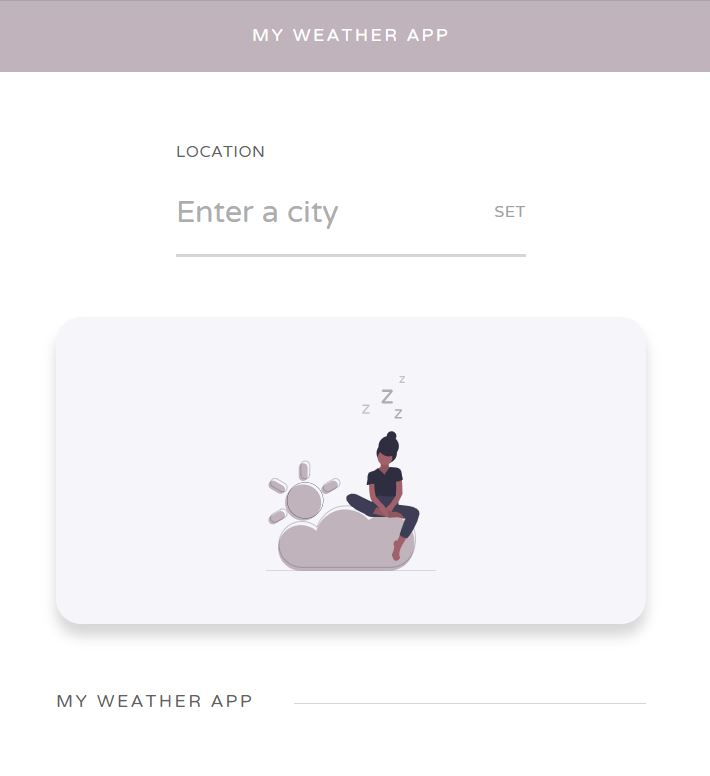
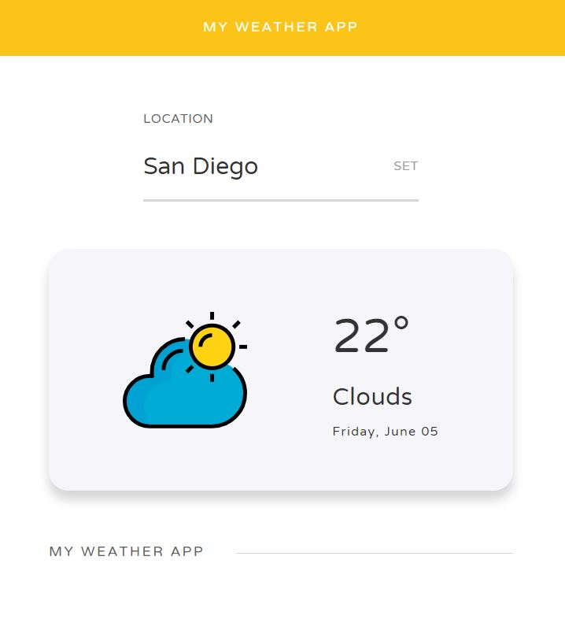

# Simple React Weather App
> React.js - Built with the [Open Weather API](https://openweathermap.org/api)

A simple weather app that allows you to get current weather information, based on the city you enter.

Deployed on [Heroku](https://my--weather--app.herokuapp.com/)

